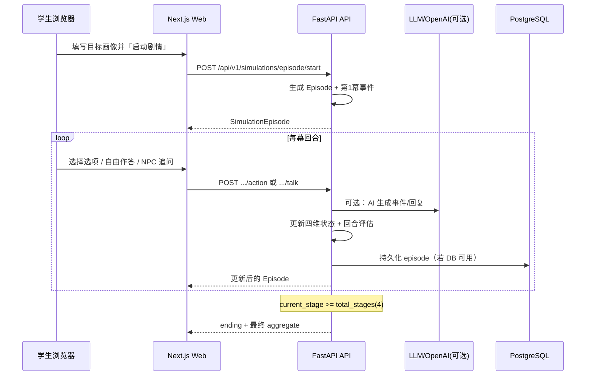
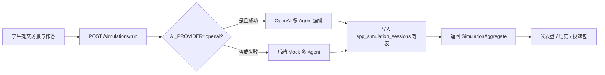

# AdaptLink · Simulation 能力说明

> 面向合作方 / 评审 / 新成员：用一份文档讲清楚平台里 **「成长与求职模拟器」** 是什么、解决什么问题、如何工作、如何演示。

---

## 一、模块定位

Simulation 是 AdaptLink 学生端的 **核心差异化能力**：把「能力评估」从静态问卷，升级为 **可交互、可复盘、可沉淀** 的模拟训练。

| 维度 | 说明 |
|------|------|
| **目标用户** | 在校学生（主）、高校导师（看结果）、企业 HR（看投递证据） |
| **核心价值** | 在低风险环境中反复演练「成长决策」与「求职压力场景」，输出 **多维能力分 + 多 Agent 评语 + 可追踪历史** |
| **产品形态** | 两条主线：**成长路径模拟（growth）**、**求职能力模拟（job）** |
| **技术特点** | 后端 FastAPI 编排 + 可选 OpenAI 真模型；**三层回退** 保证演示与部署稳定 |

学生端入口（Web）：

- 成长模拟：`/student/simulators/growth`
- 求职模拟：`/student/simulators/job`
- 历史记录：`/student/simulators/history`

---

## 二、两种模拟模式（对外介绍重点）

### 模式 A · 剧情线模拟器（主推，当前主界面）

**组件：** `StorylineSimulator`（`apps/web/components/simulator/storyline-simulator.tsx`）

学生填写「目标画像」后，系统按 **4 幕剧情** 推进：

1. 构建世界观与 NPC 冲突  
2. 每幕提供 **选项** 或 **自由作答**  
3. 可与 NPC **追问对话**（`/talk`）  
4. 回合结束触发 **能力状态变化** + **多 Agent 简评**，最终产出 **结局（ending）**

**四维状态机**（每回合实时更新，0–100）：

| 状态 | 含义 |
|------|------|
| 信心 confidence | 对当前策略的确信程度 |
| 压力 pressure | 场景压迫感 |
| 精力 energy | 可投入资源 |
| 准备度 readiness | 离目标达成的距离 |

**场景智能：** 后端会根据学生填写的目标文本，自动识别领域（如求职、学业、项目、关系等），生成不同叙事模板与 NPC 话术（`simulation_episode_service.py` 内 `_scenario_domain` 等逻辑）。

**UI 亮点（便于演示口述）：**

- Quantum 风格控制台：剧情区、节奏条、能力雷达、Agent 评语墙  
- 内置 **STAR 回答框架** 一键复制，引导学生结构化表达  
- 进度条分阶段反馈（「构建剧情世界观 → 评估能力变化 → …」）

---

### 模式 B · 单次评估工作台（轻量）

**组件：** `SimulationWorkbench`（`apps/web/components/simulator/simulation-workbench.tsx`）

学生输入 **场景描述 + 作答内容**（求职模式可填目标岗位），一次请求返回完整评估包：

- 综合得分 `overall_score`
- 能力维度 `ability_scores`（成长 8 维 / 求职 8 维，两套量表）
- 多 Agent 评审 `agent_reviews`（成长：辅导员/同伴/组织/导师；求职：HR/业务/主管/顾问）
- 改进建议 `recommendations`
- 求职模式额外附带 **岗位推荐** `job_recommendations`

适合：**快速出报告、对接仪表盘快照、投递包摘要**。

---

## 三、成长 vs 求职：能力量表对照

| 类型 `simulation_type` | 典型场景 | 能力维度侧重 | Agent 角色 |
|------------------------|----------|--------------|------------|
| `growth` | 社团负责人、竞赛队长、跨部门协作 | 原则性、责任感、同理心、领导力、执行力、协作、沟通、抗压 | 辅导员 / 同伴 / 组织 / 职业发展导师 |
| `job` | 产品运营、市场培训生、数据运营等岗位面试 | 沟通表达、逻辑分析、岗位理解、执行落地、团队协作、抗压、学习潜力、岗位匹配 | HR / 业务 / 团队主管 / 职业顾问 |

同一学生在两种模式下各有一条 **latest 快照**（供仪表盘、档案页、企业端人才详情引用）。

---

## 四、端到端流程（评审可看图）

### 4.1 剧情线 Episode 流程



### 4.2 单次评估流程



---

## 五、API 一览（`/api/v1/simulations`）

| 方法 | 路径 | 用途 |
|------|------|------|
| `POST` | `/run` | 单次模拟评估（模式 B） |
| `POST` | `/episode/start` | 开启剧情会话（模式 A） |
| `GET` | `/episode/{episode_id}` | 查询进行中/已完成剧情 |
| `POST` | `/episode/{episode_id}/action` | 提交选择或自由回答，推进回合 |
| `POST` | `/episode/{episode_id}/talk` | 与当前 NPC 追问对话 |
| `GET` | `/{growth\|job}/latest?student_id=` | 该类型最近一次聚合结果 |
| `GET` | `/history?student_id=&limit=` | 历史会话列表 |

请求/响应模型定义：`apps/api/app/schemas/simulations.py`  
路由注册：`apps/api/app/api/routes/simulations.py`

---

## 六、数据持久化

当配置 `DATABASE_URL` 时，模拟结果会写入 PostgreSQL（表由服务自动 `CREATE IF NOT EXISTS`）：

| 表名 | 内容 |
|------|------|
| `app_simulation_sessions` | 单次模拟会话：类型、场景、综合分、摘要、建议 |
| `app_simulation_messages` | 会话内消息轨迹 |
| `app_agent_reviews` | 各 Agent 打分与要点 |
| `app_simulation_ability_scores` | 维度分数 |
| `app_simulation_job_recommendations` | 求职模式岗位推荐 |
| `app_simulation_episodes` | 剧情线完整状态（阶段、对话、回合、结局） |

实现：`apps/api/app/services/simulation_persistence_service.py`

无数据库时：**剧情 Episode 仍可在内存中跑通**（`EPISODE_STORE`），单次评估回退为 Mock 快照，便于本地与 Sealos 试跑。

---

## 七、多智能体（Multi-Agent）设计

Simulation 不是「一个大模型给一段话」，而是 **分角色、分维度** 的结构化评估：

1. **能力维度 Agent（隐式）** — 通过维度列表约束输出 JSON  
2. **评审 Agent（显式）** — 如「HR 面试官 Agent」「辅导员 Agent」，各给出分数、摘要、亮点  
3. **剧情导演 / NPC（Episode）** — 负责事件标题、冲突描述、选项与开场白；追问时扮演 `npc_role`

提示词维护见源码：

- §1 单次模拟多 Agent 编排 → `agent_llm_service.py`  
- §2–3 剧情事件 JSON / NPC 对话 → `simulation_episode_service.py`

---

## 八、AI 三层回退（稳定性卖点）

| 层级 | 触发条件 | 行为 |
|------|----------|------|
| **L1 真模型** | `AI_PROVIDER=openai` 且配置 `OPENAI_API_KEY` | 调用 OpenAI，输出结构化评估 / 剧情 |
| **L2 后端 Mock** | L1 失败或未配置 | 使用内置多 Agent 模板与剧情池，**语义完整、可演示** |
| **L3 前端 Mock** | API 不可达 | `lib/api/client.ts` 内 fallback，保证页面不白屏 |

说明：Sealos 试跑常用 `AI_PROVIDER=mock`，观众看到的是 **完整产品链路**，而非空白页。

---

## 九、与平台其他模块的联动

```mermaid
flowchart TB
  subgraph Student[学生端]
    SIM[Simulation 模拟器]
    DASH[仪表盘]
    PROF[个人档案]
    APP[投递工作室]
  end
  subgraph Backend[FastAPI]
    API[/simulations/*]
    STU[/students/*]
    REC[/recommendations/*]
  end
  subgraph Others[其他角色]
    ENT[企业人才详情]
    SCH[高校学生画像]
  end

  SIM --> API
  API --> DASH
  API --> PROF
  API --> APP
  API --> ENT
  API --> SCH
  REC --> DASH
```

| 联动点 | 说明 |
|--------|------|
| **学生仪表盘** | 引用 `growth/latest`、`job/latest` 能力指标 |
| **模拟历史页** | `/student/simulators/history` 展示会话轨迹 |
| **投递证据包** | 企业端收件箱可见「简历 + 解析 + 他测 + **模拟摘要**」 |
| **企业候选人详情** | 「最近模拟记录」表格 + `simulationDigest` |
| **高校学生管理** | 学生列表/详情携带 `latest_simulation_type` 等字段 |

---

## 十、推荐演示脚本（5–8 分钟）

1. **开场（30s）**  
   说明：传统测评是「答完即走」；AdaptLink 是「在剧情里练、被多角色评、结果可进投递包」。

2. **成长模拟（3min）**  
   - 打开 `/student/simulators/growth`  
   - 填写目标角色（默认：校园项目负责人）  
   - 点击「启动剧情」→ 展示第 1 幕冲突与四维状态  
   - 选一选项或自由作答 → 展示回合评语与状态变化  
   - 可选：对 NPC 追问一句 `/talk`  
   - 跑完 4 幕后展示 **ending + Agent 评语 + 能力卡片**

3. **求职模拟（2min）**  
   - 打开 `/student/simulators/job`  
   - 强调 **岗位导向** 量表与 **岗位推荐列表**  
   - 对比 growth / job 的 Agent 角色差异

4. **闭环（1min）**  
   - `/student/simulators/history` 看沉淀  
   - 企业端候选人页：「最近模拟记录 / 投递证据包」  
   - 一句话带过三层回退与可接 OpenAI

---

## 十一、关键代码索引

| 层级 | 路径 |
|------|------|
| API 路由 | `apps/api/app/api/routes/simulations.py` |
| 单次模拟 | `apps/api/app/services/simulation_service.py` |
| 剧情 Episode | `apps/api/app/services/simulation_episode_service.py` |
| LLM 编排 | `apps/api/app/services/agent_llm_service.py` |
| 持久化 | `apps/api/app/services/simulation_persistence_service.py` |
| 数据模型 | `apps/api/app/schemas/simulations.py` |
| 剧情 UI | `apps/web/components/simulator/storyline-simulator.tsx` |
| 单次 UI | `apps/web/components/simulator/simulation-workbench.tsx` |
| 前端 API | `apps/web/lib/api/client.ts`（`runSimulation`、`startSimulationEpisode` 等） |
| 成长页 | `apps/web/app/(platform)/student/simulators/growth/page.tsx` |
| 求职页 | `apps/web/app/(platform)/student/simulators/job/page.tsx` |
| 历史页 | `apps/web/app/(platform)/student/simulators/history/page.tsx` |

---

## 十二、环境与扩展

| 变量 | 作用 |
|------|------|
| `DATABASE_URL` | 模拟结果持久化 |
| `AI_PROVIDER` | `openai` 启用真模型；`mock` 使用后端模板 |
| `OPENAI_API_KEY` / `OPENAI_BASE_URL` / `OPENAI_MODEL` | 真模型连接 |
| `NEXT_PUBLIC_API_BASE_URL` | 前端调用模拟 API 的基址 |

**可扩展方向（对外可提）：**

- LangSmith 可观测（可选）
- 按学校/企业定制剧情模板与评分 Rubric  
- 与真实岗位 JD 联动，自动生成面试题池  
- 导出 PDF 评估报告供导师批阅  

---

## 十三、ReAct Agent 模式（v3 · LangGraph 后端）

剧情模拟器 Agent 主路径已迁移至 **FastAPI + LangGraph ReAct**（`create_react_agent` + 工具化能力层）。

| 能力 | 实现 |
|------|------|
| ReAct 运行时 | `apps/api/app/services/simulation_agent_service.py`（LangGraph） |
| 工具层 | `simulation_agent_tools.py`（记忆/剧情/评估/结局/持久化） |
| 推理轨迹 | SSE 流式 `[Thought]/[Action]/[Observation]` |
| Agent 状态 | PostgreSQL `app_simulation_agent_states`（48h TTL，跨 Pod 恢复） |
| 前端 | Next 默认 `SIMULATION_AGENT_ENGINE=langgraph`，代理至 FastAPI |
| 回退 | 无 OpenAI 时规则择序 Mock ReAct；可设 `SIMULATION_AGENT_ENGINE=next` 使用 Next 本地 Agent |

**API（FastAPI `/api/v1/simulations`）：**

- `POST /agent/start`、`POST /agent/act`
- `POST /agent/start/stream`、`POST /agent/act/stream`（SSE）

**环境变量：**

- API：`AI_PROVIDER=openai`、`OPENAI_API_KEY`、`DATABASE_URL`
- Web：`SIMULATION_AGENT_ENGINE=langgraph`（默认）、`API_BASE_URL`

---

## 十四、LangGraph Checkpointer 与 agent_state 的区别

| 机制 | 存什么 | 用途 |
|------|--------|------|
| **Postgres Checkpointer**（LangGraph 官方） | ReAct 循环内部状态：消息历史、工具调用中间态、`thread_id` | 崩溃/多 Pod 时**从循环中间步**续跑 |
| **app_simulation_agent_states**（自管表） | 业务域状态：当前幕事件、回合、四维状态、结局 JSON | 前端展示、跨 HTTP 请求加载 **SimulationEpisode** |

两者**互补**：Checkpointer 管 Agent「怎么推」；agent_state 管「推成了什么给 UI」。

---

## 十五、简历优化 Agent（LangGraph）

- 默认 `RESUME_OPTIMIZER_ENGINE=langgraph`（FastAPI ReAct）
- 工具：`runJobSimulation` → `rewriteResume` → `compareProgress` → `finishOptimization`
- API：`POST /students/{id}/resume-optimize`、SSE `/resume-optimize/stream`
- 回退：`RESUME_OPTIMIZER_ENGINE=legacy` 使用旧 for 循环；Web 设 `next` 使用 Next 本地 ReAct

---

## 十六、一句话总结

> **AdaptLink Simulation = 剧情化能力演练场 + React 真 Agent 推理 + 长期记忆 + 动态结局 + 可进投递与校企协同的能力证据链。**

如需更细的提示词原文，请直接查阅 `apps/api/app/services/` 下对应 service 源码。
