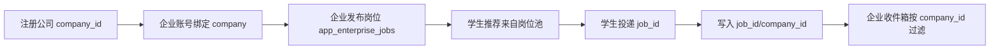
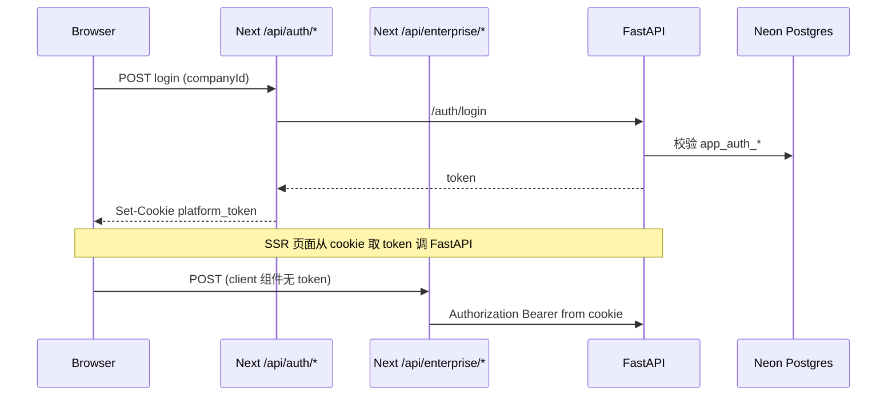

以下是对 **AdaptLink（智能人才发展与就业服务平台）** 的项目结构、技术栈与现状总结，依据 `交接.md`、`adaptlink-master/README.md` 及 `apps` 实际代码整理，便于后续优化对照。

---

## 一、仓库与工作区说明

| 路径 | 说明 |
|------|------|
| `adaptlink-master/交接.md` | 部署/联调交接说明（在**外层**目录） |
| `adaptlink-master/adaptlink-master/` | **实际 Monorepo 根目录**（`package.json`、`README.md`、`apps/` 在此） |
| GitHub | `https://github.com/Harryfox-tech/adaptlink.git` |

后续改代码、跑脚本请以 **`adaptlink-master/adaptlink-master/`** 为根目录。

---

## 二、产品定位与核心链路

**目标**：打通 **学生端投递 ↔ 企业端岗位池 ↔ 企业按 company 维度可见**，并支持三端（学生 / 企业 / 高校）人才发展能力，外加独立的 **成果转化平台** UI。

**主业务闭环（已按计划落地）**：



---

## 三、技术栈总览

| 层级 | 技术 | 说明 |
|------|------|------|
| 仓库形态 | npm workspaces Monorepo | 根 `package.json` 管理 `apps/web`、`apps/api` |
| 前端 | **Next.js 15.0.7** + React 18 + TypeScript + Tailwind | App Router；部分页面 SSR + Cookie 鉴权 |
| 前端 AI | Vercel AI SDK + `@ai-sdk/openai` | `/api/chat` 流式对话（依赖 Vercel 环境变量） |
| 前端 ORM（可选） | Prisma 6 + PostgreSQL schema | `apps/web/prisma/`；README 标注为可选，**主链路走后端 psycopg** |
| 后端 | **FastAPI** + **psycopg** + Pydantic | API 前缀 `/api/v1` |
| 数据库 | **PostgreSQL（Neon）** | 通过 `DATABASE_URL`；无库时多处 **内存 mock 回退** |
| AI（后端） | `AI_PROVIDER=mock \| openai` | `agent_llm_service.py`；失败自动 mock |
| 部署 | **Vercel**（web）+ **Railway**（api，端口 **8080**） | `apps/api/Dockerfile` |

**本地默认**：

- Web: `http://localhost:3000`
- API: `http://localhost:8000`，文档 `/docs`
- 前端 API 基址：`NEXT_PUBLIC_API_BASE_URL`（默认 `http://127.0.0.1:8000/api/v1`）

---

## 四、顶层目录对照（Monorepo 根）

| 目录/文件 | 功能 |
|-----------|------|
| `apps/web/` | Next.js 三端 UI + 成果转化 UI + Next API 路由（鉴权代理、chat、enterprise 代理） |
| `apps/api/` | FastAPI 业务 API、多智能体模拟、投递/企业/高校服务 |
| `scripts/` | `dev-start.ps1` / `dev-status.ps1` / `dev-stop.ps1` 一键本地开发 |
| `package.json` | `dev:web`、`dev:api`、`build:web` 等 workspace 脚本 |
| `README.md` | 启动说明、模拟器三层回退、Prisma 可选步骤 |
| `PROMPTS_CATALOG.md` | 全项目 LLM 提示词索引（模拟、简历、岗位建模等） |
| `pic/`、`前端风格参照图/` | 设计参考资源（非运行时代码） |

---

## 五、`apps/api` 后端结构

### 5.1 目录职责

| 路径 | 职责 |
|------|------|
| `app/main.py` | FastAPI 入口、`/health`、CORS、挂载 `api_router` |
| `app/api/router.py` | **已注册** 路由：`students`、`enterprise`、`school`、`auth`、`simulations`、`recommendations` |
| `app/api/routes/*.py` | 各域 HTTP 端点 |
| `app/services/*.py` | 业务逻辑、DB 读写、LLM 调用 |
| `app/schemas/*.py` | 请求/响应 Pydantic 模型 |
| `app/core/config.py` | 环境变量：`DATABASE_URL`、`AI_PROVIDER`、`OPENAI_*` |
| `app/core/db.py` | Neon 连接串规范化（去掉 pgbouncer 等不兼容参数） |
| `Dockerfile` | Railway 镜像，`uvicorn` 监听 **8080** |

### 5.2 已挂载 API 模块（`router.py`）

| 前缀 | 路由文件 | 主要能力 |
|------|----------|----------|
| `/api/v1/auth` | `routes/auth.py` | 公司注册、三端注册/登录、`/me`、`/profile`；企业需 `company_id` |
| `/api/v1/students` | `routes/students.py` | 仪表盘、投递列表、简历分析/抽取、评估生成/提交、**投递 submit** |
| `/api/v1/enterprise` | `routes/enterprise.py` | 岗位 CRUD、人才池、候选人详情、仪表盘、招聘/分析/校企/设置、**投递收件箱** |
| `/api/v1/school` | `routes/school.py` | 高校仪表盘、学生列表/详情、课程/项目/就业/干预/报告等 |
| `/api/v1/simulations` | `routes/simulations.py` | 单次模拟 `run`、剧情 episode（start/action/talk）、历史 |
| `/api/v1/recommendations` | `routes/recommendations.py` | 岗位推荐（无历史时从 `app_enterprise_jobs` 生成） |

### 5.3 存在但未挂载的路由（重要）

`routes/transformation.py`、`routes/demand.py` 及 `achievement_service` 等**已实现**，但 **未写入 `router.py`**。  
前端成果转化页通过 `/api/v1/transformation/...` 代理调用时，**线上后端目前不会响应这些路径**（除非后续补挂载）。

### 5.4 核心服务文件对照

| 文件 | 功能 |
|------|------|
| `auth_service.py` | 注册/登录；有 DB 用 `app_auth_*` 表，无 DB 用内存；**session token 内存**，重启需重登 |
| `application_service.py` | 投递包、简历/评估落库；`app_enterprise_jobs` 校验；企业收件箱查询；运行时 `CREATE TABLE IF NOT EXISTS` |
| `enterprise_service.py` | 企业仪表盘、岗位建模中心、招聘/分析等（含 mock/LLM） |
| `student_service.py` | 学生仪表盘、能力趋势等 |
| `school_service.py` | 高校侧统计与学生画像 |
| `recommendation_service.py` | 推荐逻辑，岗位来源切换至企业岗位池 |
| `simulation_service.py` | 单次模拟 + 持久化 |
| `simulation_episode_service.py` | 多阶段剧情模拟器（体量大，含 episode 表） |
| `agent_llm_service.py` | OpenAI 真实模型 vs mock 多智能体评估 |
| `transformation_service.py` / `demand_service.py` | 成果转化/需求（**路由未挂载**） |

### 5.5 主要数据表（`app_*`，由服务层按需建表）

| 表名 | 用途 |
|------|------|
| `app_enterprise_companies` | 公司主数据 |
| `app_auth_enterprise` (+ `company_id`/`role`) | 企业账号 |
| `app_enterprise_jobs` | 企业岗位池（`status=open` 等） |
| `app_student_applications` | 学生投递（含 `job_id`、`company_id`） |
| `app_application_packages` | 完整投递包（简历+评估+模拟摘要） |
| `app_job_recommendations` | 推荐记录 |
| `app_simulation_sessions` / `app_simulation_episodes` | 模拟会话与剧情 |
| `app_auth_students` / `app_auth_school` | 学生/高校账号 |

> **注意**：`apps/web/prisma/schema.prisma` 是另一套 Prisma 模型（User/Company/Job 等），与 FastAPI 的 `app_*` 表**并行存在**；当前主链路以 **FastAPI + psycopg** 为准。

---

## 六、`apps/web` 前端结构

### 6.1 路由组（`app/`）

| 路径 | 角色/模块 | 功能 |
|------|-----------|------|
| `/` | — | 重定向到 `/login` |
| `/login`、`/register` | 公共 | 三端登录注册 |
| `/register/company` | 公共 | **先注册公司** 获取 `company_id` |
| `(platform)/student/*` | 学生端 | 仪表盘、档案、成长/求职模拟、推荐、投递、AI 助手 |
| `(platform)/enterprise/*` | 企业端 | 招聘总览、岗位、人才池、**投递收件箱**、流程、校企、分析、设置 |
| `(platform)/school/*` | 高校端 | 培养诊断、学生管理、课程、项目、就业、干预、报告等 |
| `transformation/*`、`(transformation-platform)/*` | 成果转化 | 成果展示、需求、项目 hub（大量 **前端 demo 数据** + 部分 `/api/v1` 调用） |
| `lms-dashboard/` | LMS | 独立仪表盘页 |
| `app/api/auth/*` | BFF | 登录/注册写 **httpOnly cookie** `platform_token`，透传 `companyId` |
| `app/api/enterprise/*` | BFF | 浏览器端 POST 代理到 FastAPI（带 cookie 里 token） |
| `app/api/v1/[...path]` | 通用代理 | 转发到 `NEXT_PUBLIC_API_BASE_URL`（成果转化等用） |
| `app/api/chat` | AI | 流式助手；缺 `OPENAI_API_KEY` 报 500 |

侧边栏导航定义在 `components/layout/app-sidebar.tsx`（三端菜单与 URL 一一对应）。

### 6.2 关键库与类型

| 文件 | 功能 |
|------|------|
| `lib/api/client.ts` | **主 API 客户端**（1600+ 行）：学生/企业/高校/模拟/投递；大量 `try/catch` + **本地 fallback mock** |
| `lib/auth-client.ts` | 直连后端 `/auth/*`（注册、登录、公司注册） |
| `lib/types/index.ts` | 前端领域类型（含 `jobId`/`companyId` 等） |
| `lib/mock/data.ts` | 静态 mock 数据 |
| `lib/utils.ts` | `cn()` 等工具 |

### 6.3 组件目录（按域拆分）

| 目录 | 用途 |
|------|------|
| `components/layout/` | `platform-shell`、`app-sidebar`、`app-header`、`role-shell` |
| `components/student/`、`student-dashboard/` | 学生端 UI |
| `components/enterprise/` | 企业端 UI |
| `components/school/` | 高校端 UI |
| `components/simulator/` | 模拟器交互 |
| `components/transformation/` | 成果转化（成果卡片、需求、阶段追踪等） |
| `components/charts/`、`ui/` | 图表与基础 UI |
| `components/neo/`、`lms/` | 风格化/LMS 相关 |

### 6.4 企业端关键页面（数据打通相关）

| 页面文件 | URL | 功能 |
|----------|-----|------|
| `enterprise/applications/page.tsx` | `/enterprise/applications` | 投递收件箱列表 |
| `enterprise/applications/[id]/page.tsx` | `/enterprise/applications/:id` | 单条投递包详情 |
| `enterprise/jobs/page.tsx` | `/enterprise/jobs` | 岗位建模/发布 |
| `enterprise/dashboard/page.tsx` | `/enterprise/dashboard` | 招聘总览 |

学生投递：`student/applications/page.tsx` + `client.ts` 中 `submitStudentApplication`。

---

## 七、鉴权与请求路径（优化时常对照）



- 企业 `/enterprise/*`：**Bearer + `company_id` 强制过滤**（`enterprise.py` 中 `_require_enterprise_ctx`）。
- Token：**进程内内存**（`auth_service` 的 `_mem_sessions`），Railway 重启或扩缩容会导致会话失效。

---

## 八、AI 与模拟器三层回退（README + 代码一致）

| 层级 | 条件 | 行为 |
|------|------|------|
| 1 | 后端 `AI_PROVIDER=openai` 且 key 有效 | `agent_llm_service` 真实 LLM |
| 2 | 真实模型失败 | 后端 mock 多智能体 |
| 3 | 后端不可用 | `client.ts` 内嵌 fallback 数据 |

前端 `/student/assistant` 走 **`/api/chat`**（Vercel 环境变量），与 FastAPI LLM **独立**。

提示词维护见：`PROMPTS_CATALOG.md` → 对应 `agent_llm_service.py`、`simulation_episode_service.py`、企业/高校服务等。

---

## 九、部署现状与阻塞点（来自交接）

| 环境 | 状态 | 关键配置 |
|------|------|----------|
| **Railway API** | `https://adaptlink-production.up.railway.app` | `DATABASE_URL`（Neon）；`GET /health`；端口 **8080** |
| **Vercel Web** | 需确认 | `NEXT_PUBLIC_API_BASE_URL=https://adaptlink-production.up.railway.app/api/v1`（必须含 `https://` 与 `/api/v1`） |
| **AI** | 常阻塞 | Vercel：`OPENAI_API_KEY` 等；或 Railway：`AI_PROVIDER=openai` |

**已知问题**：

1. Railway 未配 `DATABASE_URL` → 连 `127.0.0.1:5432` 失败。  
2. Vercel `NEXT_PUBLIC_API_BASE_URL` 格式错误 → fetch URL 解析失败。  
3. `/api/chat` 缺 key → `OPENAI_API_KEY 未配置`。  
4. Railway 曾误部署 `@platform/web`，应只保留 API 服务。  
5. 成果转化 API **未挂载**，与前端代理存在缺口。

---

## 十、建议的后续优化对照维度

按模块拆任务时可直接引用：

| 维度 | 对照入口 |
|------|----------|
| 投递/收件箱/company | `application_service.py`、`enterprise.py` routes、`enterprise/applications/*` |
| 岗位池/推荐 | `enterprise_service.py`、`recommendation_service.py`、`student/recommendations` |
| 鉴权/多实例 | `auth_service.py`、`app/api/auth/*` |
| 模拟器/LLM | `simulation_*_service.py`、`agent_llm_service.py`、`PROMPTS_CATALOG.md` |
| 前端 mock 清理 | `lib/api/client.ts` 中 `fallback*` |
| 成果转化联调 | 挂载 `transformation`/`demand` 路由 + `transformation/*` 页面 |
| 部署 | `Dockerfile`、`交接.md` P0/P1 清单 |
| 双 schema 统一 | `prisma/schema.prisma` vs `app_*` 表 |

---

## 十一、本地启动速查

```bash
# 在 adaptlink-master/adaptlink-master/
npm install
npm run dev:web    # :3000

# 另开终端
cd apps/api && pip install -r requirements.txt
# 配置 apps/api/.env 的 DATABASE_URL
npm run dev:api    # :8000
```

---

以上是当前仓库的**结构—技术栈—实现边界—线上状态**对照表。你后续若说「优化企业收件箱」「接成果转化 API」「去掉 client fallback」等，可以直接指向上表中的文件/目录，我会按同一套地图改代码。若你希望把这份总结写进仓库（例如 `docs/ARCHITECTURE.md`），可以说一下我再加文件。